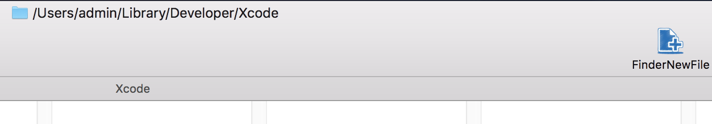

# FinderNewFile

 
 

# Description

## As a macOS Application

### How to use
- Right click on app to open, because this is not from AppStore / or build it yourself
- Cmd+Drag app icon into Finder toolbar

### Features

- [x] Add new file untitle in current folder

 
 

## Author

Pham Duy Phuc

## License

**FinderNewFile** is available under the MIT license. See the [LICENSE](https://github.com/onmyway133/FinderNewFile/blob/master/LICENSE.md) file for more info.
